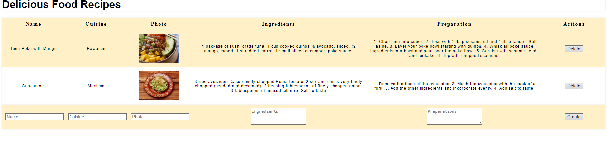

# Recipe Tracker

Use this app the create and save recipes.

## Installation

First clone this repo on your local machine and then cd into the project. Then run npm install.

```bash
  git clone https://github.com/Mculler25/Recipe-Tracker.git
  cd Recipe-Tracker
  npm install 
```
    


To use this app fill out the form fields and then hit create. Your recipe is now saved!
You can delete any recipe at any time by hitting the delete button on the right side.